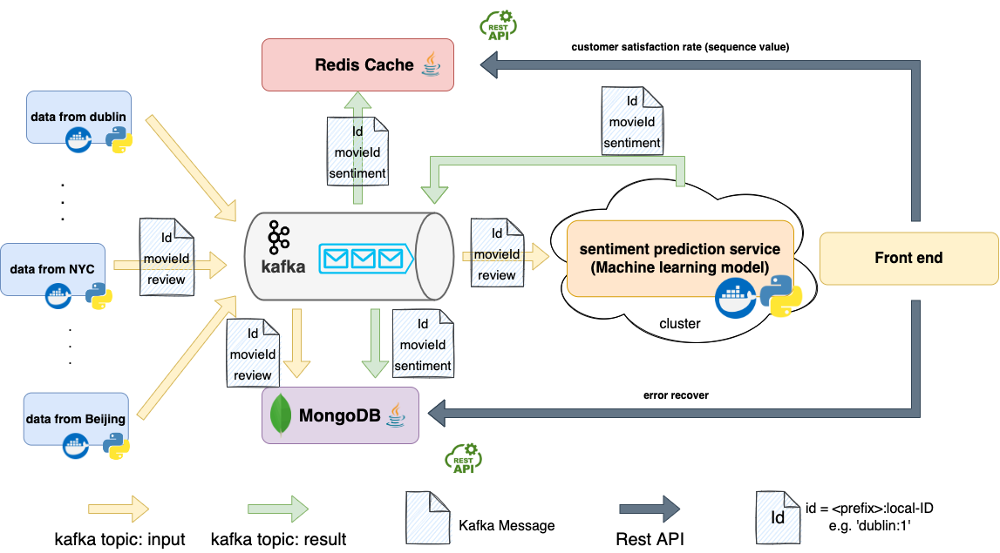

# Movie Rating System

> Group: Bug
>
> **members:** 
>
> Tianhao Liu | 20205784 | tianhao.liu@ucdconnect.ie / liutianhao328@gmail.com
>
> Haotian Shi | 20205757 | haotian.shi@ucdconnect.ie / shihaotain2002@gmail.com
>
> Xiaoyu Han  | 20205758 | xiaoyu.han@ucdconnect.ie / xiaoyuhan025@gmail.com

### Introduction

Imagine us as the world's leading movie review platform, where users from all corners of the globe can express their opinions on various films. Our primary objective is to empower users to evaluate movies and generate personalized recommendation lists based on their preferences and statistical insights.

Harnessing the power of machine learning models, we conduct sentiment analysis on user-contributed data, enabling us to gauge the satisfaction levels of our audience with each film. Our system operates on a distributed microservices architecture, ensuring high performance, fault tolerance, and scalability to meet the demands of our growing user base.

Built upon the cutting-edge distributed system technologies widely employed in the industry, our project integrates a sophisticated tech stack to ensure seamless operation and exceptional performance. We utilize Kafka as our messaging queue, facilitating efficient communication and data flow between different components of the system.

To enhance responsiveness and speed, we employ Redis as a high-performance caching solution, optimizing data retrieval and delivery. MongoDB serves as our NoSQL storage, offering scalability and flexibility to accommodate the vast amounts of user-generated content.

Moreover, we embrace a modern approach to software architecture by implementing a separation between the front-end and back-end through REST APIs. This enables us to achieve greater modularity, scalability, and maintainability, fostering a robust and adaptable system capable of meeting the evolving needs of our users.

For more details about each service and architecture discussions, please read our report in folder `docs`[here](./docs/report.pdf) <a>./docs/report.pdf</a>

### Quick Start

Here is the demo video: <a>https://drive.google.com/file/d/1P_SkUEHuJ0E4hs7-qe1jQWid1_c9iY0C/view?usp=drive_link</a>

**Pre-request:**

* Java 1.8
* Docker
* Maven

1. **Setup all the infrastructures (Kafka & zookeeper & Redis & MongoDB):**

   ~~~sh
   docker compose up
   ~~~

2. **Start Predictor Service**

   ~~~sh
   cd consumer
   
   docker build -t consumer .  
   
   docker run -it --name consumer --network host consumer
   ~~~

3. **Start Redis Service**

   ~~~sh
   cd <path to the project root>
   
   mvn clean install
   
   java -jar redis/target/redis-0.0.1-SNAPSHOT.jar
   ~~~

4. **Start MongoDB Service**

   ~~~sh
   cd <path to the project root>
   
   mvn clean install # (can be ignored if you have done once)
   
   java -jar database/target/database-2.6.0.jar
   ~~~

5. **Start Data Collection Service**

   ~~~sh
   cd producer
   
   docker build -t producer . 
   
   docker run -it --name producer --network host producer
   ~~~

**Visualize the trend of movie ratings:**

Open the static html file at `echart/index.html` in your browser 

**To view all the reviews with predicted sentiment:** 

Check `http://localhost:8080/messages`

To search for certain review:

Check `http://localhost:8080/search`
you can search by move id(1,2,3) and view the total reviews and rate of positive ratings